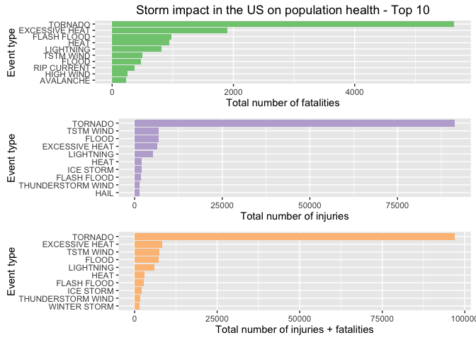
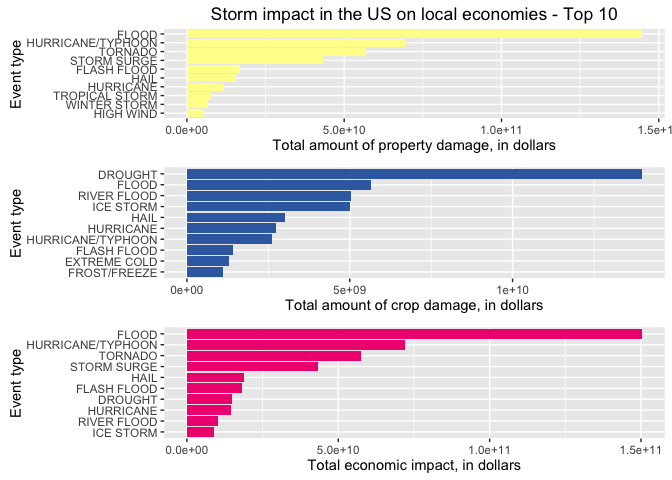

# Analysis of Population Health and Economic Impacts of Severe Weather Events
Nate LaClaire  
October 8, 2016  

This project involves analyzing NOAA (National Oceanic and Atmospheric Administration) [Storm Data](https://www.ncdc.noaa.gov/stormevents/) to determine the impact of severe weather events on local economies and population health. The goal of this analysis is to answer these two questions:

1. Across the United States, which types of events are most harmful with respect to population health?
2. Across the United States, which types of events have the greatest economic consequences?

The data provided covers 1950 through November 2011.

# Data Processing

Before loading the data, it is appropriate to load the libraries that we will use during analysis and set some options for report production:


```r
# Load libraries
library(ggplot2)
```

```
## Warning: package 'ggplot2' was built under R version 3.2.4
```

```r
library(dplyr)
```

```
## 
## Attaching package: 'dplyr'
```

```
## The following objects are masked from 'package:stats':
## 
##     filter, lag
```

```
## The following objects are masked from 'package:base':
## 
##     intersect, setdiff, setequal, union
```

```r
library(gridExtra)
library(grid)
library(RColorBrewer)

# Set some options for knitr
knitr::opts_chunk$set(tidy=FALSE, fig.path='figure/', out.height='500px')

# Create a color palette for the graphs
stormColors <- brewer.pal(6, "Accent")
```

The data was provided in a compressed CSV file, which must be downloaded from the course-provided URL and then loaded into memory:


```r
# If the .csv.bz2 file doesn't exist, download it
if (!file.exists("StormData.csv.bz2")) {
    download.file(
        "https://d396qusza40orc.cloudfront.net/repdata%2Fdata%2FStormData.csv.bz2", 
        "StormData.csv.bz2")
}

# Load the data
stormData <- read.csv("StormData.csv.bz2", stringsAsFactors = FALSE)
```

The data contains 37 variables:


```r
colnames(stormData)
```

```
##  [1] "STATE__"    "BGN_DATE"   "BGN_TIME"   "TIME_ZONE"  "COUNTY"    
##  [6] "COUNTYNAME" "STATE"      "EVTYPE"     "BGN_RANGE"  "BGN_AZI"   
## [11] "BGN_LOCATI" "END_DATE"   "END_TIME"   "COUNTY_END" "COUNTYENDN"
## [16] "END_RANGE"  "END_AZI"    "END_LOCATI" "LENGTH"     "WIDTH"     
## [21] "F"          "MAG"        "FATALITIES" "INJURIES"   "PROPDMG"   
## [26] "PROPDMGEXP" "CROPDMG"    "CROPDMGEXP" "WFO"        "STATEOFFIC"
## [31] "ZONENAMES"  "LATITUDE"   "LONGITUDE"  "LATITUDE_E" "LONGITUDE_"
## [36] "REMARKS"    "REFNUM"
```

Since we will only utilize 7 of these variables in our analysis, we create a subset of the data:


```r
stormDataSub <- select(stormData, EVTYPE, FATALITIES, INJURIES, PROPDMG, PROPDMGEXP, CROPDMG, CROPDMGEXP)
```

## Preparing the population health values

To see the total impact on population health, we first summarize the data by type of event and then sum the numbers of fatalities and injuries:


```r
# Summarize by event type
popHealth <- summarise(group_by(stormDataSub, EVTYPE), totalFatalities = sum(FATALITIES), totalInjuries = sum(INJURIES))
popHealth$totalImpact <- popHealth$totalFatalities + popHealth$totalInjuries
```

## Preparing the economic impact values

The economic values are stored with exponential values in a separate column. Some of these values are numeric, but others are symbols or abbreviations. We create new columns of recoded values to use as the exponents:


```r
# Look at the original exponent values
unique(stormDataSub$PROPDMGEXP)
```

```
##  [1] "K" "M" ""  "B" "m" "+" "0" "5" "6" "?" "4" "2" "3" "h" "7" "H" "-"
## [18] "1" "8"
```

```r
unique(stormDataSub$CROPDMGEXP)
```

```
## [1] ""  "M" "K" "m" "B" "?" "0" "k" "2"
```

```r
# Create new columns, filling them with numeric values from existing columns
stormDataSub$PROPDMGEXP.B <- as.numeric(stormDataSub$PROPDMGEXP)
```

```
## Warning: NAs introduced by coercion
```

```r
stormDataSub$CROPDMGEXP.B <- as.numeric(stormDataSub$CROPDMGEXP)
```

```
## Warning: NAs introduced by coercion
```

```r
# Recode alphabetic characters as numbers and symbols as 0
stormDataSub$PROPDMGEXP.B[stormDataSub$PROPDMGEXP %in% c('B','b')] <- 9
stormDataSub$CROPDMGEXP.B[stormDataSub$CROPDMGEXP %in% c('B','b')] <- 9
stormDataSub$PROPDMGEXP.B[stormDataSub$PROPDMGEXP %in% c('M','m')] <- 6
stormDataSub$CROPDMGEXP.B[stormDataSub$CROPDMGEXP %in% c('M','m')] <- 6
stormDataSub$PROPDMGEXP.B[stormDataSub$PROPDMGEXP %in% c('K','k')] <- 3
stormDataSub$CROPDMGEXP.B[stormDataSub$CROPDMGEXP %in% c('K','k')] <- 3
stormDataSub$PROPDMGEXP.B[stormDataSub$PROPDMGEXP %in% c('H','h')] <- 2
stormDataSub$CROPDMGEXP.B[stormDataSub$CROPDMGEXP %in% c('H','h')] <- 2
stormDataSub$PROPDMGEXP.B[stormDataSub$PROPDMGEXP %in% c("", "+", "-", "?")] <- 0
stormDataSub$CROPDMGEXP.B[stormDataSub$CROPDMGEXP %in% c("", "+", "-", "?")] <- 0

# Verify that only non-NULL numeric values are in the new columns
unique(stormDataSub$PROPDMGEXP.B)
```

```
##  [1] 3 6 0 9 5 4 2 7 1 8
```

```r
unique(stormDataSub$CROPDMGEXP.B)
```

```
## [1] 0 6 3 9 2
```

We then do the math to yield new columns containing the actual values:


```r
stormDataSub$propertyDamage <- stormDataSub$PROPDMG * (10^stormDataSub$PROPDMGEXP.B)
stormDataSub$cropDamage <- stormDataSub$CROPDMG * (10^stormDataSub$CROPDMGEXP.B)
```

Now that we have actual values, we summarize the data by the type of weather event:


```r
econImpact <- summarise(group_by(stormDataSub, EVTYPE), propertyDamage = sum(propertyDamage), cropDamage = sum(cropDamage))
```

Finally, we create a column to store the total economic impact:


```r
econImpact$economicImpact <- econImpact$propertyDamage + econImpact$cropDamage
```

# Results

## Across the United States, which types of events are most harmful with respect to population health?

Tornadoes cause the most injuries and fatalities.


```r
# Figure 1, composed of 3 plots
healthPlot1 <- ggplot(data=head(popHealth[order(popHealth$totalFatalities, decreasing = TRUE),],10), aes(x=reorder(EVTYPE, totalFatalities), y=totalFatalities)) +
   geom_bar(fill=stormColors[1],stat="identity")  + coord_flip() + 
    ylab("Total number of fatalities") + xlab("Event type") +
    ggtitle("Storm impact in the US on population health - Top 10") +
    theme(legend.position="none")

healthPlot2 <- ggplot(data=head(popHealth[order(popHealth$totalInjuries, decreasing = TRUE),],10), aes(x=reorder(EVTYPE, totalInjuries), y=totalInjuries)) +
    geom_bar(fill=stormColors[2],stat="identity") + coord_flip() +
    ylab("Total number of injuries") + xlab("Event type") +
    theme(legend.position="none")

healthPlot3 <- ggplot(data=head(popHealth[order(popHealth$totalImpact, decreasing = TRUE),],10), aes(x=reorder(EVTYPE, totalImpact), y=totalImpact)) +
    geom_bar(fill=stormColors[3],stat="identity") + coord_flip() +
    ylab("Total number of injuries + fatalities") + xlab("Event type") +
    theme(legend.position="none")

grid.arrange(healthPlot1, healthPlot2, healthPlot3, nrow = 3)
```



## Across the United States, which types of events have the greatest economic consequences?

Floods have the highest total economic impact, followed by hurricanes/typhoons, tornadoes, storm surges, and hail. Interestingly, droughts cause the most crop damage.


```r
# Figure 2, composed of 3 plots
econPlot1 <- ggplot(data=head(econImpact[order(econImpact$propertyDamage, decreasing = TRUE),],10), aes(x=reorder(EVTYPE, propertyDamage), y=propertyDamage)) +
   geom_bar(fill=stormColors[4],stat="identity")  + coord_flip() + 
    ylab("Total amount of property damage, in dollars") + xlab("Event type") +
    ggtitle("Storm impact in the US on local economies - Top 10") +
    theme(legend.position="none")

econPlot2 <- ggplot(data=head(econImpact[order(econImpact$cropDamage, decreasing = TRUE),],10), aes(x=reorder(EVTYPE, cropDamage), y=cropDamage)) +
    geom_bar(fill=stormColors[5],stat="identity") + coord_flip() +
    ylab("Total amount of crop damage, in dollars") + xlab("Event type") +
    theme(legend.position="none")

econPlot3 <- ggplot(data=head(econImpact[order(econImpact$economicImpact, decreasing = TRUE),],10), aes(x=reorder(EVTYPE, economicImpact), y=economicImpact)) +
    geom_bar(fill=stormColors[6],stat="identity") + coord_flip() +
    ylab("Total economic impact, in dollars") + xlab("Event type") +
    theme(legend.position="none")

grid.arrange(econPlot1, econPlot2, econPlot3, nrow = 3)
```


